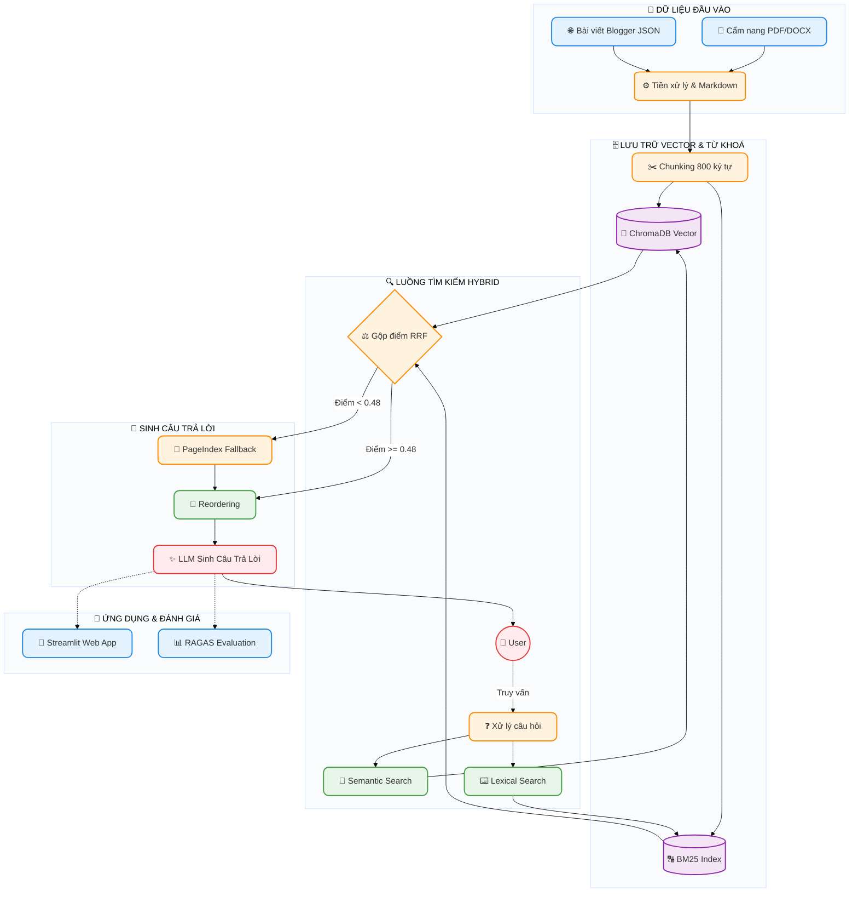

# Bài Tập Nhóm — Chủ Đề 5: Trợ Lý Hướng Dẫn Viên Du Lịch Thông Minh

## Mục Tiêu

Sau khi hoàn thành bài cá nhân, nhóm ngồi lại để xây dựng **1 trong 2 sản phẩm**:

---

## Yêu cầu 1: Sản phẩm nhóm RAG Chatbot

Xây dựng chatbot trả lời câu hỏi về chính sách thương mại điện tử và hỗ trợ khách hàng liên quan.

**Yêu cầu:**

- Giao diện chat (Streamlit / Gradio / Chainlit)
- Trả lời có citation (dựa trên Task 10)
- Hỗ trợ follow-up questions (conversation memory)
- Hiển thị source documents đã dùng

**Stack gợi ý:**

```
Chainlit/Streamlit → Retrieval (Task 9) → Generation (Task 10) → Display
```

---

## Yêu cầu 2: RAG Evaluation Pipeline

Sử dụng **1 trong 3 framework** sau để evaluate pipeline RAG của nhóm:

### Framework lựa chọn

| Framework                                           | Cài đặt               | Đặc điểm                                      |
| --------------------------------------------------- | ------------------------ | ------------------------------------------------- |
| [DeepEval](https://github.com/confident-ai/deepeval) | `pip install deepeval` | Nhiều metric built-in, dễ integrate với pytest |
| [RAGAS](https://github.com/explodinggradients/ragas) | `pip install ragas`    | Chuẩn industry cho RAG eval, 3 trục chính      |
| [TruLens](https://github.com/truera/trulens)         | `pip install trulens`  | Dashboard UI, feedback functions mạnh            |

### Yêu cầu Evaluation

1. **Tạo Golden Dataset** — tối thiểu 15 cặp Q&A (question, expected_answer, expected_context)
2. **Chạy evaluation** trên toàn bộ golden dataset với các metrics sau:
   - **Faithfulness** — câu trả lời có bám đúng context không?
   - **Answer Relevance** — câu trả lời có đúng câu hỏi không?
   - **Context Recall** — retriever có lấy đủ evidence không?
   - **Context Precision** — trong context lấy về, bao nhiêu % thực sự hữu ích?
3. **So sánh A/B** — chạy eval trên ít nhất 2 config khác nhau (ví dụ: có reranking vs không reranking, hoặc hybrid vs dense-only)
4. **Báo cáo** — bảng điểm + phân tích worst performers + đề xuất cải tiến

Xem code mẫu (DeepEval/RAGAS/TruLens) chi tiết trong `README.md` gốc mục "Yêu cầu 2".

### Deliverable Evaluation

- [ ] File `group_project/evaluation/golden_dataset.json` — 15+ cặp Q&A
- [ ] File `group_project/evaluation/eval_pipeline.py` — script chạy evaluation
- [ ] File `group_project/evaluation/results.md` — bảng điểm + phân tích
- [ ] So sánh A/B ít nhất 2 configs

---

## Yêu Cầu Chung

1. **Tích hợp pipeline** từ bài cá nhân của các thành viên
2. **Demo hoạt động được** trong buổi trình bày (chạy local hoặc deploy)
3. **Evaluation pipeline** chạy được và có báo cáo kết quả
4. **Code push lên repository** chung của nhóm
5. **README** mô tả kiến trúc và phân công (điền bên dưới)

---

## Kiến Trúc Hệ Thống



---

## Phân Công Công Việc

| Thành viên          | MSSV        | Nhiệm vụ                            | Trạng thái |
| --------------------- | ----------- | ------------------------------------- | ------------ |
| Lê Hồ Quang Huy     | 2A202602026 | Role 1 (Team Leader & RAG Architect)  | Hoàn thành |
| Nguyễn Tiến Đạt  | 2A202601056 | Role 2 (Data & Dense Search Dev)      | Hoàn thành |
| Nguyễn Nam Phong     | 2A202601320 | Role 3 (Sparse Search & Reranking)    | Hoàn thành |
| Kiều Phúc Huy       | 2A202601678 | Role 4 (Frontend & Chatbot Developer) | Hoàn thành |
| Lã Phan Hoài An     | 2A202601846 | Role 5 (Evaluation & QA Engineer)     | Hoàn thành |

---

## Hướng Dẫn Chạy

```bash
# Cài đặt dependencies
pip install -r requirements.txt

# Chạy app
streamlit run app.py
# hoặc
chainlit run app.py
```

---

## Lưu ý

Hãy giữ lại repo này nếu như bạn học track 3 giai đoạn 2, chúng ta sẽ phát triển tiếp dự án lên knowledge graph để khắc phục các câu hỏi hóc búa khi có các câu hỏi khó.
